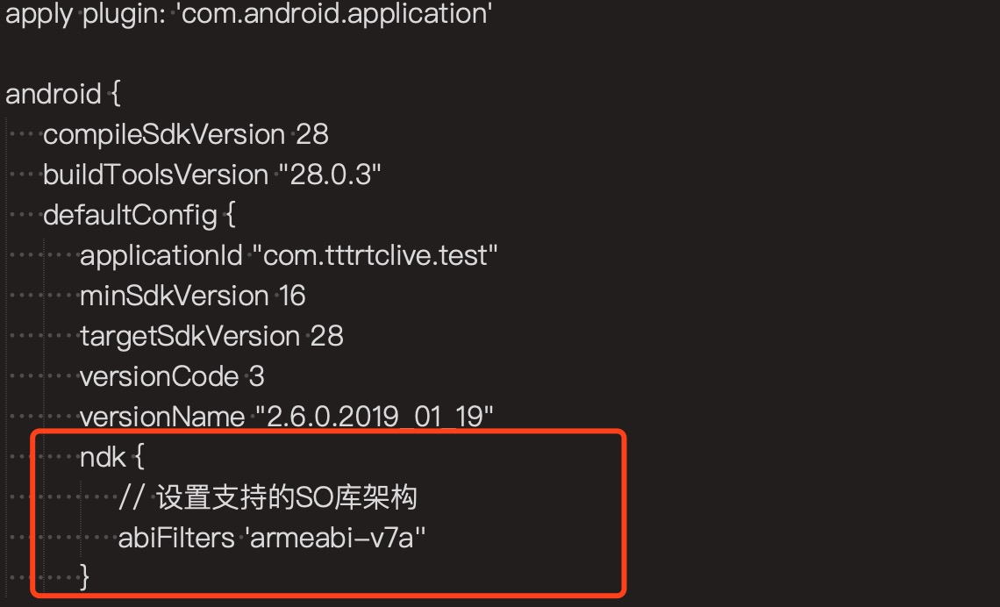
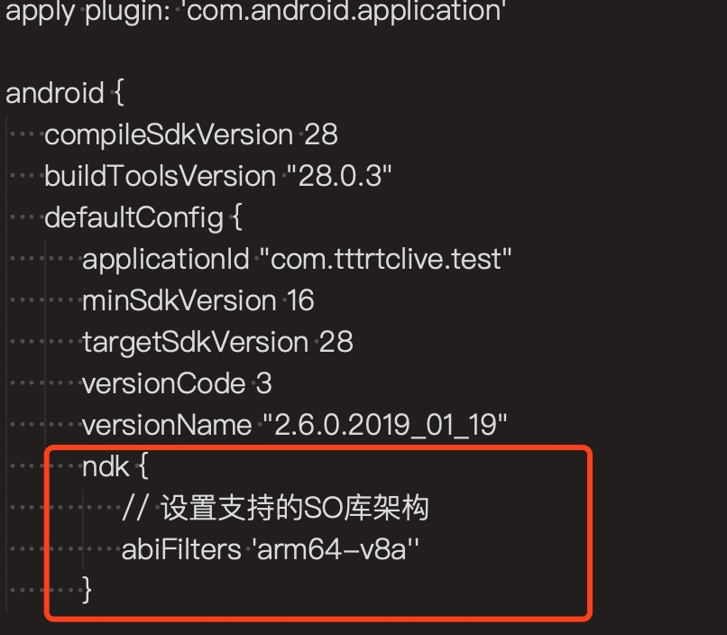

## 三体音视频 SDK 防止混淆配置
如果 App 添加了混淆配置，在使用 SDK 时需要添加如下配置，防止 SDK 代码混淆。  

 * -keep class ttt.ijk.media.**{*;}
 * -keep class project.android.imageprocessing.**{*;}
 * -keep class org.TTTRtc.voiceengine.**{*;}
 * -keep class com.wushuangtech.**{*;}
 * -dontwarn ttt.ijk.media.**

## 三体音视频 SDK 架构选择
在项目下的 **build.gradle** 文件中，如果符合以下任意一种情况，则使用 **arm64-v8a** 架构的 SDK，否则请选择 **armeabi-v7a** 架构。  

1. 文件中没有红框内的代码，即没有指定 so 库所使用的架构，默认会用 **arm64-v8a**。

	
2. 文件中有红框内的代码，并且指定了需要使用 **arm64-v8a** 架构。


## 三体音视频 SDK 发版说明

### 2.9.7版本
该版本于 2020.06.09 发布。

1. 优化回声消除；
2. 在onUserKicked回调中，添加一个新的错误码。  

```
/**
 * 直播模式下，主播长时间(默认100秒)无音频或视频上行，推流失败。
 */
public static final int ERROR_RTC_PUSH_ERROR = 110;
```


### 2.9.6版本
1、修复屏幕分享需要使用aac音频格式的问题。   
2、解决一个摄像头机型适配问题，可能会引起本地视频预览黑屏。  
3、**Constants** 类添加摄像头链接失败错误码。  

```
/**
 * 相机链接丢失，系统中断当前相机链接。
 */
public static final int ERROR_CAMERA_CONNECT_LOST = 1;

/**
 * 相机打开失败。
 */
public static final int ERROR_CAMERA_CONNECT_FAILED = 2;
```

### 2.9.5版本
该版本于 2020.05.11 发布。

**从此版本开始，SDK仅支持Android 4.3(18)以上的系统版本**

## 类 TTTRtcEngine API 变更
### API 删除
1. 移除常量 **Constants.ERROR\_CAMERA\_OPEN\_FAILED**，请参考回调 **onCameraConnectError**。

### API 变更
1. 接口 **setVideoMixerParams** 添加智感超清功能参数 **qulityMode** ，详情请参考文档介绍。
2. 接口 **CreateRendererView** 修改为静态方法。

## 类 TTTRtcEngineEventHandler 回调 API 变更

### API 新增
1. 新增回调 **onCameraConnectError** 上报，通知 app 摄像头链接失败。

## 优化
1. 优化视频质量档位，添加640x480和960x540。
2. 优化摄像头采集方式，增加视频流畅度。

#-------------------------------------------

### 2.7.1版本
该版本于2020年03月11日发布。

## 优化
1. 优化日志上报。
2. 解决一个内存泄漏问题。
3. 更新64位sdk的版本。 

#-------------------------------------------

### 2.7.0版本
该版本于2020年02月29日发布。

## 类 TTTRtcEngine API 变更
### API 删除
1. 接口 **public abstract int joinChannel(String token, String channelName, long optionalUid, boolean enableChat, boolean enableSignal)** 删除。  

## 问题修复  
1. 优化外部视频源接口，视频编码器开始的时机，解决视频硬编有可能失败。  
2. 解决一个退房间有小概率 SDK 会出现死锁，从而出现 ANR 的问题。  

## 优化
1. 优化远端视频打开时间。
2. 优化信令重发的问题。
3. 优化 SDK 视频解码器默认为软解模式。 
4. 优化断网重连。

#-------------------------------------------

### 2.6.0版本
该版本于2020年01月19日发布。

## 类 TTTRtcEngine API 变更
### API 删除
1. 接口 **create** 删除原第三个参数 **enableChat** ，参数从4个变为3个。  
2. 删除 **聊天功能** 相关接口，如下表：

	```
	/**
	* 发送聊天信息
	 */
	public abstract int sendChatMessage(long nDstUserID, int type, String sSeqID, String sData);
	
	/**
	 * 发送信令
	 */
	public abstract int sendSignal(long nDstUserID, String sSeqID, String sData);
	
	/**
	 * 开始采集聊天语音（限制60s以内）
	 */
	public abstract int startRecordChatAudio();
	
	/**
	 * 停止采集并且发送语音消息
	 */
	public abstract int stopRecordAndSendChatAudio(long nDstUserID, String sSeqID);
	
	/**
	 * 取消语音采集
	 */
	public abstract int cancelRecordChatAudio();
	
	/**
	 * 播放语音消息
	 */
	public abstract int startPlayChatAudioFileName(String audioPath);
	
	/**
	 * 停止播放语音消息
	 */
	public abstract int stopPlayChatAudio();
	
	/**
	 * 是否正在播放语音消息
	 */
	public abstract boolean isChatAudioPlaying();
	```

3. 接口 **setSignalTimeout** 返回值类型从 **void** 变为 **int** 。

### API 变更
1. 接口 **onFirstLocalVideoFrame** 参数宽和高，从上报的**视频编码**宽和高，修改为**视频渲染**宽和高。

### API 新增
无

## API TTTRtcEngineEventHandler 回调接口变更
### API 删除
1. 回调接口 **onVideoStopped** 删除。

## 问题修复
1. 修复 SDK 在操作用户信息或用户设备信息时，有几率触发空指针异常。
2. 修复视频编码器在某些情况下，硬编与软编都有可能开启，导致编码异常。
3. 修复在某些机型下(nexus 6)，摄像头前后切换，分辨率不一样，导致出现黑屏问题。
4. 修改 adjustAudioMixingSoloVolume 接口调用限制，加入频道后就可以调用，而不是开始播放伴奏后。
5. 修复在某些分辨率和机型下，有几率出现编码花屏对问题。
6. 修复 SDK 其他一些崩溃问题，提升稳定性。
7. 修复 **onRemoteVideoFrameDecodedOfUid** 回调不上报的问题，使用了硬解，使用这个回调暂时必须用软解，在调用 **joinChannel(加入频道)** 接口前，调用 **forceVideoDecodeSoftware** 接口，代码如下所示。

	```
	mTTTEngine.getTTTRtcEngineExtend().forceVideoDecodeSoftware(true);
	```

## 优化
1. 新增纯音频主播带副播跨房间PK。
2. 优化网络传输。

#-------------------------------------------

### 2.5.0版本
该版本于2019年12月21日发布。

## 类 TTTRtcEngine API 变更

### API 删除
1.**enableUplinkAccelerate** 接口已不再支持。

### API 变更
1.调整 **setPreferAudioCodec** 接口的参数取值范围。

```
/**
 * 设置音频编码参数。
 * <p/>
 * 默认 SDK 使用 ISAC 格式，适用于通话场景，而在对音质需求高的直播场景，推荐使用 AAC 或 OPUS，显式调用该 API 变更。
 * <p/>
 * 使用注意：<br/>
 * 1.该方法需要在 joinChannel(加入频道) 之前设置好，joinChannel 后设置不生效。<br/>
 * 2.若使用 startRecordScreenAndSave(屏幕录制) 或 startRecordScreen(屏幕共享) API，则必须使用 AAC 。
 * <p/>
 *
 * @param codecType 音频编码格式，支持的类型如下：<br/>
 *                  {@link Constants#TTT_AUDIO_CODEC_AAC}<br/>
 *                  {@link Constants#TTT_AUDIO_CODEC_ISAC}<br/>
 *                  {@link Constants#TTT_AUDIO_CODEC_OPUS}<br/>
 * @param bitrate   音频编码码率，范围如下：<br/>
 *                  {@link Constants#TTT_AUDIO_CODEC_AAC}  码率范围48kbps ~ 128kbps<br/>
 *                  {@link Constants#TTT_AUDIO_CODEC_ISAC} 码率范围16kbps ~ 32kbps<br/>
 *                  {@link Constants#TTT_AUDIO_CODEC_OPUS} 码率范围16kbps ~ 128kbps<br/>
 * @param channels  声道数，支持单声道和双声道，参数范围是1 ~ 2
 *                  <p/>
 * @return 0 代表方法调用成功，其他代表失败。<br/>
 * ERROR_FUNCTION_INVOKE_ERROR -4 ：已加入频道，调用会失败。<br/>
 * ERROR_FUNCTION_ERROR_ARGS -5 ：传递的参数有问题，比如所设置的音频编码格式、码率大小、或声道数不支持。
 */
public abstract int setPreferAudioCodec(int codecType, int bitrate, int channels);
```

2.调整 **startAudioMixing** 接口，增加对 **assets** 文件夹内的文件访问，调整 **cycle** 参数的取值。

```
/**
 * 开始播放音乐文件及混音。
 * <p/>
 * 该 API 指定本地或在线音频文件来和麦克风采集的音频流进行混音或替换，替换是指用音频文件替换麦克风采集的音频流，并且可以选择是否让对方听到本地播放的音频，
 * 并指定循环播放的次数。
 * <p/>
 * 成功调用后，当播放结束，会收到 {@link TTTRtcEngineEventHandler#onAudioMixingPlayFinish} 回调通知调用者音乐播放完毕。
 *
 * @param filePath 指定需要混音的本地音频文件名和文件路径。支持以下音频格式：mp3, mp4, aac, m4a, wav, flac。<br/>
 *                 如果用户提供的目录以 /assets/ 开头，则去 assets 里面查找该文件。<br/>
 *                 如果用户提供的目录不是以 /assets/ 开头，一律认为是在绝对路径里查找该文件。
 * @param loopback true：只有本地可以听到混音或替换后的音频流，false：本地和对方都可以听到混音或替换后的音频流。
 * @param replace  true：音频文件内容将会替换本地录音的音频流，false：音频文件内容将会和麦克风采集的音频流进行混音。
 * @param cycle    指定音频文件循环播放的次数，从 1 开始，0 无效。<br/>
 *                 正整数：循环的次数。<br/>
 *                 -1：无限循环。
 *                 <p/>
 * @return 0 代表方法调用成功，其他代表失败。<br/>
 * ERROR_FUNCTION_INVOKE_ERROR -4 ：调用失败，原因未知，请尝试重新调用。<br/>
 * ERROR_FUNCTION_ERROR_ARGS -5 ：参数有问题。<br/>
 * 1.可能是音乐文件路径不对或不存在。<br/>
 * 2.循环次数错误，只能是正整数或-1。
 */
public abstract int startAudioMixing(String filePath, boolean loopback, boolean replace, int cycle);
```

3.SDK 内部不再监听 IJK 控件相关回调，拉流成功/错误。即用户不会再收到关于 IJK 的 **onJoinChannelSuccess** 或 **onError**，需要自行接收回调，接收方法如下：

```
mIjkVideoView = mTTTEngine.CreateIjkRendererView(this);
...
...
...
// 监听拉流成功的回调通知。
mIjkVideoView.setOnRenderingStart(new IjkVideoView.OnRenderingStart() {
    @Override
    public void onRendering() {
        Toast.makeText(mContext, "拉流成功", Toast.LENGTH_SHORT).show();
    }
});

// 监听拉流中出现的异常错误或主播停止推流，终止当前的拉流。
mIjkVideoView.setOnErrorListener(new IMediaPlayer.OnErrorListener() {
    @Override
    public boolean onError(IMediaPlayer iMediaPlayer, int what, int extra) {
        showErrorExitDialog("拉流出现错误, type-" + what);
        return false;
    }
});
```

4.SDK 修改了关于 **OnInfoListener** 回调类的接口列表，将之前的 **onVolume** 和 **onH264SeiReport** 等方法分离出来，具体修改如下：

```

mIjkVideoView = mTTTEngine.CreateIjkRendererView(this);
...
...
...
// 以前的代码
mIjkVideoView.setOnInfoListener(new OnInfoListener() {
    @Override
    public boolean onInfo(IMediaPlayer iMediaPlayer, int i, int i1) {
        return false;
    }
    
	 @Override
    public boolean onVolume(IMediaPlayer iMediaPlayer, HashMap<Long, Double> hashMap) {
        return false;
    }
            
    @Override
    public void onH264SeiReport(String s) {

    }
});

// 现在的代码
mIjkVideoView.setOnInfoListener(new OnInfoListener() {
    @Override
    public boolean onInfo(IMediaPlayer iMediaPlayer, int i, int i1) {
        return false;
    }
});

mIjkVideoView.setOnVoluemeReportCallBack(new OnVoluemeReportCallBack() {
    @Override
    public boolean onVolume(IMediaPlayer iMediaPlayer, HashMap<Long, Double> hashMap) {
        return false;
    }
});

mIjkVideoView.setOnVideoSeiReportCallBack(new IjkVideoView.OnVideoSeiReportCallBack() {
    @Override
    public void onH264SeiReport(String s) {

    }
});

5.SDK 修改了关于 OnInfoListener 回调类的接口列表，将之前的 onVolume 和 onH264SeiReport 等方法分离出来，具体修改如下：

```

### API 新增

1.IJK 拉流模块新增对下行音视频码率、帧率和延迟的统计。

```
// 4.监听拉流中的音视频下行数据统计信息，每 2 秒上报一次。
mIjkVideoView.setOnRtmpPullDataCallBack(new OnRtmpPullDataCallBack() {
    @Override
    public void onPullStatusValuesReport(RtmpPullStatusBean bean) {
    
    }
});

public class RtmpPullStatusBean {
	// 视频流下行帧率
   public int mVideoFps;
   // 视频流下行码率
   public int mVideoBitrate;
   // 音频流下行帧率
   public int mAudioBitrate;
   // 视频流下行延迟
   public long mVideoDelay;
   // 音频流下行延迟
   public long mAudioDelay;
}
```

2.RTMP 直推模块新增对上行音视频码率、帧率的统计，回调接口与加入频道相同。

```
/**
 * 通话、直播或RTMP 直推中，本地视频流的统计信息回调。
 * <p/>
 * 该回调描述本地设备发送视频流的统计信息，每 2 秒触发一次。
 *
 * @param stats 本地视频相关的统计信息类，其中包含的信息为: <br/>
 *              mSentBitrate：实际发送码率，单位为 Kbps。<br/>
 *              mSentFrameRate：实际发送帧率，单位为 fps。<br/>
 *              mVideoLossRate：视频流上行丢包率，百分比小数，范围0 ~ 1 之间，RTMP 直推中此参数为 0 。<br/>
 *              mVideoBuffer：视频缓冲区大小，单位毫秒，RTMP 直推中此参数为 0 。<br/>
 *              mDelay：视频流上行延迟，单位毫秒，RTMP 直推中此参数为 0 。
 */
void onLocalVideoStats(LocalVideoStats stats);

/**
 * 通话、直播或RTMP 直推中，本地音频流的统计信息回调。
 * <p/>
 * 该回调描述本地设备发送音频流的统计信息，每 2 秒触发一次。
 *
 * @param stats 本地音频相关的统计信息类，其中包含的信息为: <br/>
 *              mSentBitrate：实际发送码率，单位为 Kbps。<br/>
 *              mAudioLossRate：音频流上行丢包率，百分比小数，范围0 ~ 1 之间，RTMP 直推中此参数为 0 。<br/>
 *              mAudioDelay：音频流上行延迟，单位毫秒，RTMP 直推中此参数为 0 。
 */
void onLocalAudioStats(LocalAudioStats stats);
```

#-------------------------------------------

### 2.4.0版本
该版本于2019年10月24日发布。
## API TTTRtcEngine 接口变更
### 新增以下方法
```
/**
 * 停止/恢复音频采集和播放功能
 *
 * @param stop YES: 停止采集和播放  NO: 恢复采集和播放
 * @return 0代表方法调用成功，其他代表失败。see {@link LocalSDKConstants#FUNCTION_SUCCESS}
 */
public abstract int stopAudioPlayAndRecord(boolean stop);

/**
 * 启用/禁用本地和远端音频混音后的裸数据上报，默认禁用
 *
 * @param enabled true代表启用上报，false代表禁用上报
 */
public abstract void enableMixAudioDataReport(boolean enabled);

/**
 * 设置上报的本地音频裸数据的采样率，声道数和采样点数
 *
 * @param sampleRate     采样率，可设置为 8000，16000，32000，44100 或 48000
 * @param channel        声道数，最多支持两个声道
 * @param samplesPerCall 采样点数
 * @return 0代表方法调用成功，其他代表失败。see {@link LocalSDKConstants#FUNCTION_SUCCESS}
 */
public abstract int setRecordingAudioFrameParameters(int sampleRate, int channel, int samplesPerCall);

/**
 * 设置上报的远端音频裸数据的采样率，声道数和采样点数
 *
 * @param sampleRate     采样率，可设置为 8000，16000，32000，44100 或 48000
 * @param channel        声道数，最多支持两个声道
 * @param samplesPerCall 采样点数
 * @return 0代表方法调用成功，其他代表失败。see {@link LocalSDKConstants#FUNCTION_SUCCESS}
 */
public abstract int setPlaybackAudioFrameParameters(int sampleRate, int channel, int samplesPerCall);

/**
 * 设置上报的本地和远端音频裸数据，经过混音后数据的采样率，声道数和采样点数
 *
 * @param sampleRate     采样率，可设置为 8000，16000，32000，44100 或 48000
 * @param channel        声道数，最多支持两个声道
 * @param samplesPerCall 采样点数
 * @return 0代表方法调用成功，其他代表失败。see {@link LocalSDKConstants#FUNCTION_SUCCESS}
 */
public abstract int setMixedAudioFrameParameters(int sampleRate, int channel, int samplesPerCall);

/**
 * 增加旁路推流地址。SDK 会在本地触发 onRtcPushStatus 回调，报告增加旁路推流地址的状态
 *
 * @param url 旁路推流地址
 * @param transcodingEnabled 是否转码
 * @return 0代表方法调用成功，其他代表失败。see {@link LocalSDKConstants#FUNCTION_SUCCESS}
 */
public abstract int addPublishStreamUrl(String url, boolean transcodingEnabled);

/**
 * 删除旁路推流地址。SDK 会在本地触发 onRtcPushStatus 回调，报告删除旁路推流地址的状态
 * @param url 旁路推流地址
 * @return 0代表方法调用成功，其他代表失败。see {@link LocalSDKConstants#FUNCTION_SUCCESS}
 */
public abstract int removePublishStreamUrl(String url);

/**
 * 设置视频混屏的背景图片，默认是黑色背景。图片源仅支持http协议的网络地址，不支持本地图片路径，图片格式支持主流的jpg，png等<br/>
 * 注意:该接口是多旁路推流功能的版本，单推流的版本无 streamUrl 参数
 *
 * @param url 背景图片所在的地址
 * @param streamUrl 旁路推流地址
 * @return 0代表方法调用成功，其他代表失败。see {@link LocalSDKConstants#FUNCTION_SUCCESS}
 */
public abstract int setVideoMixerBackgroundImgUrl(String url, String streamUrl);

/**
 * 发送伴奏歌曲的歌词信息
 * @param lyric 歌词内容
 *
 * @return 0代表方法调用成功，其他代表失败。see {@link LocalSDKConstants#FUNCTION_SUCCESS}
 */
public abstract int sendAudioLyric(String lyric);

```

## API TTTRtcEngineEventHandler 回调接口变更
### 接口变更

1. 以下回调接口列表，会在**参数列表末尾**添加 **int elapsed** 参数，表示当前回调自加入房间起，到触发该回调所用的时间，**单位秒**，例如：
 
	```
	public void onJoinChannelSuccess(String channel, long uid, int elapsed) {
	```
	onJoinChannelSuccess  
	onUserJoined  
	onFirstLocalVideoFrame  
	onFirstRemoteVideoDecoded  
	onFirstRemoteVideoFrame  
	
2. 本地录制和远端的**音频裸数据(PCM)**回调接口，现在支持对数据进行二次修改，并再将数据传输给SDK，涉及的回调接口:  
	onLocalAudioDataReport  
	onRemoteAudioDataReport  
	返回值从 **void** 修改 **byte[]** ，返回空值表示不对原始音频数据做任何修改。  
	**注意：二次修改操作是同步操作**
	
### 新增以下方法

```
/**
 * 获取本地录制和播放音频混音后的裸数据
 *
 * @param data       PCM数据
 * @param size       PCM数据长度
 * @param sampleRate 采样率
 * @param channels   声道数
 */
byte[] onMixedAudioFrame(byte[] data, int size, int sampleRate, int channels);
    
/**
 * 接收歌词信息
 *
 * @param uid 歌词发送者的id
 * @param lyric    歌词内容
 */
void onReceiveAudioLyric(long uid, String lyric);

```

## SDK 对象变更

1.**LocalAudioStats** 类新增以下字段：
 
```
/**
 * 瞬时值，本地音频流的上行丢包率(百分比小数)
 */
private float mAudioLossRate;

/**
 * 瞬时值，本地音频流的端到端延迟(毫秒)
 */
private int mAudioDelay;
```

2.**LocalVideoStats** 类新增以下字段： 

```
/**
 * 瞬时值，本地视频上行端到端延迟(毫秒)
 */
private int mDelay;
```

3.**RemoteAudioStats** 类新增以下字段：

```
/**
 * 瞬时值，远端用户音频流的下行丢包率(百分比小数)
 */
private float mAudioLossRate;

/**
 * 瞬时值，远端用户音频流的下行延迟(毫秒)
 */
private int mAudioDelay;
```

4.**RemoteVideoStats** 类新增以下字段：

```
/**
 * 瞬时值，本地视频下行丢包率(百分比小数)
 */
private float mVideoLossRate;
```

5.**ScreenRecordConfig** 类修改

* 删除以下字段:  

	```
	/**
	 * 设置录屏时音频码率大小。
	 */
	public int mRecordAudioBitRate;
	```
	该字段的功能现由接口 **setPreferAudioCodec** 代替设置，详细用法参考官网API文档介绍。
	
* 新增以下字段:  

	```
	/**
	 * 设置录屏时视频的关键帧间隔，单位秒，默认值为1
	 */
	public int mRecordIFrameInterval;
	```
6.**VideoCompositingLayout** 类新增以下字段：

```
/**
 * 设置目标推流地址，画中画布局参数将在该推流地址中生效。仅用于多推流场景下，单推流场景无需关注此字段。
 */
public String mStreamUrl;
```

7.**TTTVideoCanvas** 类，字段 **mShowMode** 删除 **RENDER\_MODE\_ADAPTIVE** 选项

#-------------------------------------------

### 2.3.0版本
该版本于2019年8月19日发布。
### 新增功能

#### 伴奏功能，相关接口以及回调
```
/**
 * 调节伴奏本地播放音量。
 *
 * @param volume 伴奏音量范围为0~100。默认50为原始文件音量。
 * @return 0代表方法调用成功，其他代表失败。see {@link LocalSDKConstants#FUNCTION_SUCCESS}
 */
public abstract int adjustAudioMixingPlayoutVolume(int volume);
```

```
/**
 * 调节伴奏远端播放音量。
 *
 * @param volume 伴奏音量范围为0~100。默认50为原始文件音量。
 * @return 0代表方法调用成功，其他代表失败。see {@link LocalSDKConstants#FUNCTION_SUCCESS}
 */
public abstract int adjustAudioMixingPublishVolume(int volume);
```

#### 外部音频源功能，相关接口以及回调
```
/**
 * 该方法设置是否使用外部音频源。
 *
 * @param enable     是否使用外部音频源。true使用，false不使用
 * @param sampleRate 外部音频源的采样率
 * @param channels   外部音频源的通道数，支持的参数为单声道(1)，双声道(2)
 * @return 0代表方法调用成功，其他代表失败。see {@link LocalSDKConstants#FUNCTION_SUCCESS}
 */
public abstract int setExternalAudioSource(boolean enable, int sampleRate, int channels);
```

```
/**
 * 推送外部音频帧。
 *
 * @param data 外部音频数据。
 * @return 0代表方法调用成功，其他代表失败。see {@link LocalSDKConstants#FUNCTION_SUCCESS}
 */
public abstract int pushExternalAudioFrame(byte[] data);
```

#### 摄像头功能，相关接口以及回调

```
/**
 * 检测设备是否支持摄像头缩放功能。
 *
 * @return true：设备支持相机缩放功能，false：设备不支持相机缩放功能
 */
public abstract boolean isCameraZoomSupported();
```

```
/**
 * 检测设备是否支持闪光灯常开。<br/>
 * 一般情况下，App 默认开启前置摄像头，因此如果你的前置摄像头不支持闪光灯常开，<br/>
 * 直接使用该方法会返回 false。如果需要检查后置摄像头是否支持闪光灯常开，需要先使用 switchCamera 切换摄像头，再使用该方法。<br/>
 *
 * @return true：设备支持闪光灯常开，false：设备不支持闪光灯常开
 */
public abstract boolean isCameraTorchSupported();
```

```
/**
 * 检测设备是否支持手动对焦功能。
 *
 * @return true：设备支持手动对焦功能，false：设备不支持手动对焦功能
 */
public abstract boolean isCameraFocusSupported();
```

```
/**
 * 检测设备是否支持手动曝光功能。
 *
 * @return true：设置支持手动曝光功能，false：设备不支持手动曝光功能
 */
public abstract boolean isCameraExposurePositionSupported();
```

```
/**
 * 检测设备是否支持人脸对焦功能。
 *
 * @return true：设备支持人脸对焦功能，false：设备不支持人脸对焦功能
 */
public abstract boolean isCameraAutoFocusFaceModeSupported();
```

```
/**
 * 设置摄像头缩放比例。
 *
 * @param factor 相机缩放比例，有效范围从 1.0 到最大缩放
 * @return true代表方法调用成功，false代表失败。
 */
public abstract boolean setCameraZoomFactor(int factor);
```

```
/**
 * 获取摄像头支持最大缩放比例。
 *
 * @return 该相机支持的最大缩放比例。
 */
public abstract int getCameraMaxZoomFactor();

```

```
/**
 * 设置是否打开闪光灯。
 *
 * @return true：打开，false：关闭
 */
public abstract boolean setCameraTorchOn(boolean isOpen);
```
#### 本地音频录音功能，相关接口以及回调

```
/**
 * 开始客户端录音
 *
 * @param filePath 录音文件的本地保存路径: xxx/.../xxx.aac
 * @param quality  录音质量，类型如下：<br/>
 *                 {@link Constants#TTT_AUDIO_RECORDING_QUALITY_LOW} 低音质。采样率为 48 kHz，码率 16 kpbs，录制 10 分钟的文件大小为 1.2 M 左右。<br/>
 *                 {@link Constants#TTT_AUDIO_RECORDING_QUALITY_MEDIUM} 中音质。采样率为 48 kHz，码率 32 kpbs，录制 10 分钟的文件大小为 2 M 左右。<br/>
 *                 {@link Constants#TTT_AUDIO_RECORDING_QUALITY_HIGH} 高音质。采样率为 48 kHz，码率 64 kpbs，录制 10 分钟的文件大小为 3.75 M 左右。<br/>
 * @return 0代表方法调用成功，其他代表失败。see {@link LocalSDKConstants#FUNCTION_SUCCESS}
 */
public abstract int startAudioRecording(String filePath, int quality);
```

```
/**
 * 停止客户端录音
 *
 * @return 0代表方法调用成功，其他代表失败。see {@link LocalSDKConstants#FUNCTION_SUCCESS}
 */
public abstract int stopAudioRecording();
```

```
/**
 * 本地音频录音完成通知。
 */
void onAudioRecordFinish();
```

#### 其他功能，相关接口以及回调
```
/**
 * 设置耳返音量，在打开耳返的情况下有效。
 *
 * @param volume 设置耳返音量，取值范围在 [0,100] 默认值为 100。
 * @return 0代表方法调用成功，其他代表失败。see {@link LocalSDKConstants#FUNCTION_SUCCESS}
 */
public abstract int setAudioEarBackVolume(int volume);
```

```
/**
 * 获取网络连接状态
 *
 * @return 返回当前网络连接状态，类型如下：
 * {@link Constants#TTT_CS_DISCONNECTED} 未加入房间,加入房间失败后，或者离开房间之后。<br/>
 * {@link Constants#TTT_CS_CONNECTING} 加入房间正在建立网络连接。<br/>
 * {@link Constants#TTT_CS_CONNECTED} 网络连接建立成功。<br/>
 * {@link Constants#TTT_CS_RECONNECTING} 网络连接重连中。<br/>
 * {@link Constants#TTT_CS_FAILED} 网络连接失败。<br/>
 */
public abstract int getConnectionState();
```

```
/**
 * 网络连接状态发生改变。
 *
 * @param status 当前网络连接状态
 */
void onConnectionChangedToState(int status);
```

```
/**
 * 获取当前摄像头的ID，类型如下:<br/>
 * {@link Constants#TTT_CAMERA_FRONT} 代表前置摄像头<br/>
 * {@link Constants#TTT_CAMERA_BACK} 代表后置摄像头<br/>
 * {@link Constants#TTT_CAMERA_EXTERNAL} 代表外置摄像头<br/>
 *
 * @return 当前摄像头的ID。
 */
public abstract int getCameraFace();
```

```
/**
 * 设置默认订阅的视频流类型。
 *
 * @param streamType 设置视频流大小。视频流类型如下：<br/>
 *                   {@link Constants#VIDEO_STEAM_TYPE_BIG} 视频大流，即高分辨率、高码率视频流。<br/>
 *                   {@link Constants#VIDEO_STEAM_TYPE_SMALL} 视频小流，即低分辨率、低码率视频流。<br/>
 * @return 0代表方法调用成功，其他代表失败。see {@link LocalSDKConstants#FUNCTION_SUCCESS}
 */
public abstract int setRemoteDefaultVideoStreamType(int streamType);
```
